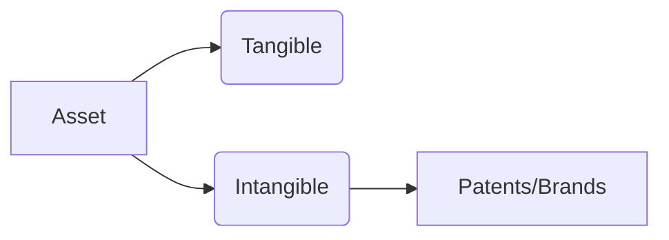

# Natural MD Style Beautifier

Since you are stripping back to what works naturally without fighting the parser or requiring the "Insiders" version of the theme, here are the core Markdown features that work reliably.

These utilize the extensions you have already enabled to give you a "Web App" feel while keeping your `.md` files clean and manageable.

### 1. Admonitions (Callout Blocks)

These are your bread and butter for "beautification." They create a colored box with an icon. Since you have the Indigo theme, these look very sharp.

* **Types:** `note`, `tip`, `info`, `warning`, `danger`, `question`.
* **Best For:** Key definitions, exam warnings, and shortcuts.

```markdown
!!! info "NISM Definition"
    An Investment Adviser is defined under SEBI (Investment Advisers) Regulations, 2013.

!!! tip "Quick Memory Rule"
    **S**hares = **S**take (Ownership)
    **B**onds = **B**orrowing (Debt)

```

---

### 2. Content Tabs

These are the most effective way to save space on your wide-screen layout. Instead of scrolling down, you click through tabs.

* **Best For:** Comparing two similar concepts or showing "Concept vs. Example."

```markdown
=== "Theory"
    Systematic risk affects the entire market.
=== "Examples"
    * Interest rate changes
    * Inflation
    * Political instability

```

---

### 3. Collapsible "Spoiler" Blocks

These keep your pages from looking "cluttered" with too much text.

* **Best For:** Hiding the answers to your practice questions or long mathematical proofs.

```markdown
??? question "Click to reveal the Answer"
    The correct answer is **Option C**. 
    *Rationale:* Beta measures systematic risk, not unsystematic risk.

```

---

### 4. Footnotes

These are great for adding technical "legal" citations or NISM regulation numbers without breaking the flow of your study notes.

* **Best For:** Referencing specific SEBI circulars or dates.

```markdown
The lock-in period for an Anchor Investor is 30 days[^1].

[^1]: Per latest SEBI (ICDR) Regulations as of 2024.

```

---

### 5. Inline Icons (Emojis & Material Icons)

Since you enabled the `pymdownx.emoji` extension, you can use icons directly in your text to make it scannable.

* **Best For:** Bullet points and headings.

```markdown
* :material-check-circle: Registered Investment Adviser (RIA)
* :material-close-circle: Unregistered Entities
* :material-clock-outline: 3-Year Record Keeping Requirement

```

---

### 6. Mermaid Charts (The Visual King)

As you decided, this is the most unbreakable way to add "beauty." It converts code directly into clean graphics.

* **Best For:** Organization charts, transaction flows, and market hierarchies.



---

### 7. Task Lists

These add a nice "Interactive" checklist feel to your study plan.

* **Best For:** Tracking which chapters you have completed.

```markdown
- [x] Chapter 1: Introduction to Securities
- [ ] Chapter 2: Secondary Markets
- [ ] Chapter 3: Technical Analysis

```

### 8. Standard Tables (With Alignment)

Tables are great for data, but they only look "beautiful" if you use proper alignment.

* Use `:---` for left-aligned (text)
* Use `---:` for right-aligned (numbers/math)
* Use `:---:` for centered (status/yes-no)

```markdown
| Instrument | Risk Profile | Settlement Cycle |
| :--------- | :----------: | ---------------: |
| Equity     | High         | T+1 Days         |
| Govt Bond  | Low          | T+1 Days         |
| Derivatives| Very High    | Daily MTM        |

```

---

### 9. Definition Lists

Instead of bullet points, use definition lists for terminology. This gives a much cleaner "dictionary" look where the term is bolded and the definition is slightly indented.

**Markdown Syntax:**

```markdown
Beta
:   A measure of a stock's volatility in relation to the overall market.

Alpha
:   The excess return of an investment relative to the return of a benchmark index.

```

---

### 10. Blockquotes for Legal Clauses

Since the NISM-RA exam involves specific SEBI regulations, use blockquotes to separate "Direct Law" from your own "Study Notes."

```markdown
> "No person shall act as an investment adviser unless he has obtained a certificate of registration from the Board under these regulations."
> 
> -- *SEBI (Investment Advisers) Regulations, 2013*

```

---

### 11. Horizontal Rules (Separators)

Use three dashes `---` to create a thin line. This is essential for breaking up long chapters into distinct sub-topics without using a new heading.

```markdown
### Primary Market Types
Content about IPOs...

---

Content about Rights Issues...

```

---

### 12. Nested Lists (Hierarchies)

Use nested lists to show how different entities are related. This works naturally on your full-width layout.

```markdown
* **Regulators**
    * SEBI (Capital Markets)
    * RBI (Money Markets)
    * IRDAI (Insurance)
* **Market Participants**
    * Stock Brokers
    * Depository Participants (DP)

```

---

### 13. Code Spans for Technical Terms

Even if you aren't writing code, use the "backtick" ``` to highlight specific technical buttons, paths, or variables so they stand out in your text.

```markdown
To calculate the **Sharpe Ratio**, you must subtract the `Risk_Free_Rate` from the `Actual_Return`.

```

### 14. Pro-Tip: The "Simple Table" Alternative

If you find standard tables too restrictive, use an **Admonition with a List** inside it. It looks much more like a "Web App Card" than a table does.

```markdown
!!! note "Quick Comparison"
    * **Equity:** Ownership | High Risk | T+1
    * **Debt:** Loan | Low Risk | T+1

```

By sticking to these, you avoid all the HTML/CSS alignment bugs and keep your site 100% stable. Are there any other specific NISM data types (like complex formulas) you need to organize?
### Summary of "The Look"

By using **Admonitions** for blocks, **Tabs** for comparisons, and **Mermaid** for diagrams, your site will look like a modern documentation portal without a single line of messy HTML.

