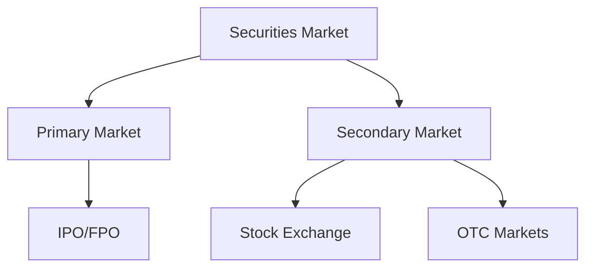

Since you are using the **Material for MkDocs** theme, you already have access to some of the most powerful "content beautification" tools in the static site world. You don't need new tech; you just need to enable the right **Markdown Extensions**.

Here is how to transform your plain text into a professional study portal using **Admonitions**, **Content Tabs**, and **Mermaid Diagrams**.

---

### 1. Enable the "Power Tools" in `mkdocs.yml`

First, ensure these extensions are in your `markdown_extensions` section:

```yaml
markdown_extensions:
  - admonition
  - pymdownx.details
  - pymdownx.superfences:
      custom_fences:
        - name: mermaid
          class: mermaid
          format: !!python/name:pymdownx.superfences.mermaid_format
  - pymdownx.tabbed:
      alternate_style: true

```

---

### 2. Technique: Admonitions (Beautiful Info Boxes)

These are perfect for "NISM Tips" or "Warning" boxes. You can use types like `note`, `tip`, `danger`, `quote`, or `abstract`.

**Markdown:**

```markdown
!!! tip "Exam Strategy"
    Expect at least 2-3 questions on the difference between Warrants and Call Options. Remember: Warrants are issued by the company!

!!! danger "Negative Marking"
    Don't guess! A wrong answer costs you **0.25 marks**. If unsure, leave it unattempted for 0 marks.

```

---

### 3. Technique: Mind Maps & Flowcharts (Mermaid.js)

Instead of uploading images, you can "code" your diagrams. This keeps the site fast and the text searchable.

**Markdown:**



---

### 4. Technique: Content Tabs (Clean Comparisons)

If you want to compare two concepts (like Equity vs. Debt) without taking up the whole page, use tabs.

**Markdown:**

```markdown
=== "Equity Shares"
    * Represents ownership.
    * Variable returns (Dividends).
    * Higher risk, higher reward.

=== "Debentures"
    * Represents a loan (Debt).
    * Fixed returns (Interest).
    * Lower risk, priority in liquidation.

```

---

### 5. Technique: Collapsible Details (The "Hidden" Answer)

Before you build the full quiz, you can use these for "Quick Check" questions within your notes.

**Markdown:**

```markdown
??? question "Quick Check: Who regulates the Mutual Fund industry?"
    **SEBI** (Securities and Exchange Board of India). 
    AMFI is a self-regulatory body, not the primary regulator.

```

---

### 6. Technique: Grid Layouts (Dashboard View)

If you want to show 2 or 3 boxes side-by-side (like a dashboard), you can use the `grid` feature.

**Markdown:**

```markdown
<div class="grid cards" border style="display: grid; grid-template-columns: repeat(auto-fit, minmax(200px, 1fr)); gap: 1rem;">

-   :material-timer: __Duration__
    120 Minutes
-   :material-format-list-numbered: __Questions__
    100 MCQs
-   :material-check-decagram: __Passing Score__
    60%

</div>

```

---

### Summary Table for your Notes

| Feature | Best Use Case |
| --- | --- |
| **Admonitions** | Highlighting NISM Exam tips or warnings. |
| **Mermaid** | Showing the "Hierarchy of Regulators" or "Transaction Cycles." |
| **Tabs** | Comparing "American vs European Options." |
| **Details** | Hiding long proofs or math derivations to keep page clean. |

Since you've got the **Navy Blue** (Indigo) theme set up, these boxes and tabs will automatically inherit those colors, making the whole site look like a premium paid course!

Which of these do you think will help most with the "Company Analysis" chapters? (They usually have the most complex flowcharts!)