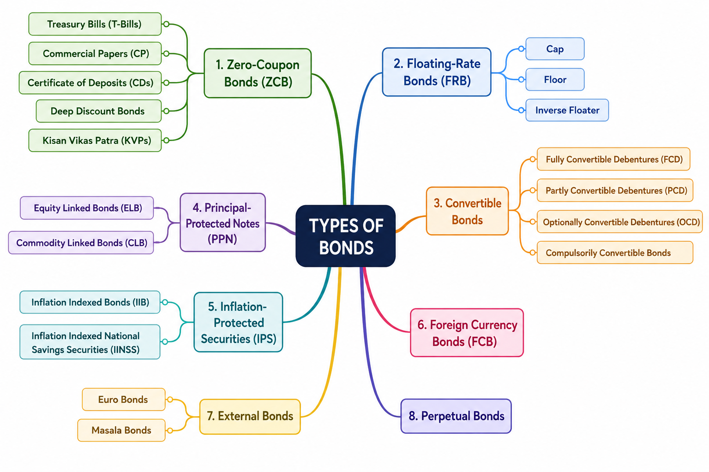

```
LEARNING OBJECTIVE:

After studying this chapter, you should know about: 

* Terminology used in equity markets
* Terminology used in debt markets
* Different types of bonds and their features

```

## Introduction

Security markets enable investors to deploy surplus funds into investment instruments that are regulated, standardized, and generally liquid. 

Broadly, securities are classified into:

1. Equity Securities 
2. Debt Securities

Choosing between equity and debt involves a trade-off between **risk and return**. Investors seeking stable and lower-risk returns generally prefer debt instruments, while those seeking higher returns accept the higher risk associated with equity investments.  

## 3.1 Terminology in Equity Market

### 3.1.1 Face Value (FV)

"Face Value (FV), also called **Par Value** or **Nominal Value**, is the original value assigned to a share at the time of issue."

> $$\text{Equity Share Capital} = \text{Number of Shares Issued}\times\text{Face Value}$$

Suppose a company issues 1,00,000 Shares at Face Value of ₹10, Then, $\text{Equity Share Capital} = 1,00,000\times10 = \text{₹10,00,000}$

!!! tag "Key Points:"

**A. Shares may be issued:**

- At Face Value (Par)
- At Premium
- At Discount

**B. Effect of Stock Split:**

If One share of FV = ₹10 splits into 5 shares, Then: [$\text{New Face Value} = \frac{10}{5} = \text{₹2}$]

Investor Holding: Before Split = 1 Share. After Split = 5 Shares

**C. Importance in Dividend Calculation:**

Dividend percentage is always calculated on face value.

**Case 1:**  FV = ₹10, Dividend = 30%, then $Dividend = 10\times30\% = \text{₹3.00}$

**Case 2:**  FV = ₹2, Dividend = 30%, then $Dividend = 2\times30\% = \text{₹0.60}$

!!! tip "Remember: Face Value affects dividend calculations but does not determine market price."

### 3.1.2 Book Value

Book Value represents the **Net Worth** of a company. 

> $\text{Net Worth} = \text{Equity Capital} + \text{Reserves & Surplus}$

Book Value Per Share indicates the theoretical amount receivable by each shareholder if:

- Assets are sold at book value
- Liabilities are fully paid
- Remaining amount is distributed among shareholders

> $$\text{Book Value Per Share} = \frac{\text{Net Worth}}{\text{Outstanding Shares}}$$


!!! tag "Key Point: Book value is based on accounting records and may differ significantly from actual realizable value."

### 3.1.3 Market Value

Market Value is the price at which a share is traded on the stock exchange.

> $$\text{Market Capitalization} = \text{Market Price Per Share} \times \text{Number of Outstanding Shares}$$

If Share Price = ₹500 and Shares Outstanding = 10 lakh, Then: [$Market Cap = 500\times10,00,000 = \text{₹50 Crore}$]

**Key Point:** Market Value changes continuously based on:

- Demand and Supply
- Earnings Expectations
- Economic Conditions
- Investor Sentiment

### 3.1.4 Replacement Value

**Replacement Value** is the **current cost of recreating the company's assets**. 

It represents the amount required today to build another company with the same infrastructure, plants, machinery, and other assets.

If a new company were to set up with all the infrastructure/plants, which an already existing company has, then the cost which it would have to bear today is known as the ‘Replacement Value’ of the existing firm.

> **Remember:** It is based on the **cost of replacing assets**, not on future earnings.

### 3.1.5 Intrinsic Value

**Intrinsic Value** is the **estimated true value** of a share based on its **future earning potential (future benefits to investors)**. It is an estimate and may be higher, lower, or equal to the market price.

> **Remember:** Intrinsic Value reflects **what a share should be worth**, while Market Value reflects **what investors are currently willing to pay**.

### Market Value vs Intrinsic Value

| Basis                     | Market Value                                                     | Intrinsic Value                                                    |
| ------------------------- | ---------------------------------------------------------------- | ------------------------------------------------------------------ |
| Meaning                   | Current trading price of a share in the stock market             | Estimated true value of a share based on future earning potential  |
| Determined By             | Demand & supply, market sentiment, liquidity, expectations       | Fundamental analysis and future cash-earning potential             |
| Nature                    | Actual market price                                              | Estimated value                                                    |
| Changes                   | Changes continuously during market hours                         | Changes when business fundamentals or valuation assumptions change |
| Can it differ?            | Yes                                                              | Yes                                                                |
| Investment Interpretation | Used for buying and selling in the market                        | Used to judge whether a share is fairly valued                     |
| Decision Rule             | If **Market Value < Intrinsic Value** → Share is **Undervalued** | If **Market Value > Intrinsic Value** → Share is **Overvalued**    |

> Exam Tip

* **Market Value = What the market is paying today.**
* **Intrinsic Value = What the share is actually worth (estimated).**
* **Replacement Value = What it would cost today to recreate the company's assets.**

This level of explanation is sufficient for **Chapter 3 (2 marks)**. The mathematical estimation of **Intrinsic Value (Discounted Cash Flow method)** is introduced later in **Chapter 10: Valuation Principles**.

### 3.1.6 Market Capitalization (Market Cap)

**Market Capitalization (Market Cap)** is the **total market value of a company's outstanding shares**. It reflects how much the market values the entire company.

**Formula:**

> $$\text{Market Cap} = \text{Market Price per Share} \times \text{Outstanding Shares}$$

**Example:**

If a company has Outstanding Shares = 1,00,000 and Market Price = ₹20 per share, Then:

$\text{Market Cap} = \text{1,00,000} \times \text{₹}20 = \text{₹20,00,000}$

|Categories of Stocks|   |
|------------------------|----|
| **Large Cap:** | Largest companies, highly liquid, usually blue-chip companies.|
| **Mid Cap:** | Medium-sized companies with moderate liquidity.|
| **Small Cap:** | Smaller companies with relatively lower liquidity.|

**Note:** 

* There is no fixed cut-off for Large, Mid, or Small Cap. The classification is based on the company's ranking by market capitalization and may change over time.
* The **Market Cap to GDP ratio** is used to measure the size and importance of a country's stock market.

### 3.1.7 Enterprise Value

**Enterprise Value (EV)** represents the **total value of a business**. It includes the value of **equity and debt**, but excludes **cash and non-operating investments**, since they are not required for the core business.

**Formula (Standalone Company):**

> $$\text{EV} = \text{Market Value of Equity} + \text{Preferred Capital} + \text{Debt} - \text{Cash} - \text{Non-operating Investments}$$

**Example:**

| Particular                  | Value (₹ Crore) |
| --------------------------- | --------------: |
| Market Value of Equity      |            34.0 |
| Preferred Capital           |             8.5 |
| Debt                        |             6.4 |
| Less: Cash                  |           (2.5) |
| Less: Financial Investments |           (1.4) |
| **Enterprise Value (EV)**   | **₹45.0 Crore** |

**Key Points:**

* **Market Capitalization** measures only the value of shareholders' equity.
* **Enterprise Value** measures the **total value of the business**, including debt.
* EV is widely used in **company valuation** because it reflects the cost of acquiring the entire business.

### 3.1.8 Earnings – Historical, Trailing and Forward

| Type of Earnings        | Meaning                                                                                  | Based On                            | Usage                                                                   |
| ----------------------- | ---------------------------------------------------------------------------------------- | ----------------------------------- | ----------------------------------------------------------------------- |
| **Historical Earnings** | Actual profits earned in previous financial periods.                                     | Past financial statements           | Used to evaluate past performance.                                      |
| **Trailing Earnings**   | Profits earned during the **most recent rolling period** (e.g., TTM or last 4 quarters). | Latest 12 months or last 4 quarters | Used for current valuation when the financial year is not yet complete. |
| **Forward Earnings**    | Estimated future profits based on projected revenue and expenses.                        | Future forecasts and assumptions    | Used to estimate future growth and company valuation.                   |

> **Exam Tip:** Historical = Past | Trailing = Latest | Forward = Future

### 3.1.9 Earnings Per Share (EPS)

**Earnings Per Share (EPS)** is the **profit earned by the company for each outstanding equity share**. It measures the company's profitability from a shareholder's perspective.

Formula:

> $$\text{EPS} = \frac{\text{Net Profit}}{\text{Number of Outstanding Shares}}$$

**Example:** If Net Profit = **₹10 lakh** and Outstanding Shares = **2 lakh** Then,

$\text{EPS} = \frac{\text{10,00,000}}{\text{2,00,000}} = \text{₹5}$

**Key Points:**

* EPS indicates the **profit attributable to each equity share**.
* **Higher EPS** generally indicates **better profitability** and is viewed positively by investors.
* EPS is an important factor in determining a company's share price and valuation.

> Exam Tip: Higher EPS = Higher Profitability = More Attractive to Investors.

### 3.1.10.1 Dividend Per Share (DPS)

**Dividend Per Share (DPS)** is the **actual dividend amount paid for each equity share**. It represents the portion of the company's profits distributed to shareholders.

If dividend is declared as a percentage of face value:

> $$\text{DPS} = \text{Face Value} \times \text{Dividend %}$$

OR

> $$\text{DPS}=\frac{\text{Total Dividend Paid}}{\text{Outstanding Shares}}$$

Example: A company declares a **40% dividend** on a share with **Face Value = ₹10**.

$\text{DPS} = 10 \times \text{40 %} = \text{₹4}$

Key Points

* DPS is expressed in **₹ per share**.
* Dividend is generally declared as a **percentage of Face Value**.
* **Dividend Payout Ratio = DPS / EPS**

### 3.1.10.2 Dividend Yield

**Dividend Yield** measures the **annual dividend earned as a percentage of the current market price**. It indicates the cash return an investor receives from dividends on the amount invested.

> $$\text{Dividend Yield} = \frac{\text{Dividend Per Share}}{\text{Market Price Per Share}} \times 100$$

**Example:** If Dividend Per Share = **₹4**, and Market Price = **₹80** Then,

$\text{Dividend Yield} = \frac{4}{80}\times100 = 5\%$

**Key Points:**

- Dividend Yield is expressed as a **percentage (%)**.
- It measures the **return from dividends** on the current market price.
- A higher yield may indicate: Higher cash income for investors, or A falling share price.

### Dividend Per Share (DPS) vs Dividend Yield

| Basis    | Dividend Per Share (DPS)                    | Dividend Yield                                  |
| -------- | ------------------------------------------- | ----------------------------------------------- |
| Meaning  | Dividend paid for each share                | Dividend return as a percentage of market price |
| Based On | **Face Value** of the share                 | **Market Price** of the share                   |
| Formula  | Face Value × Dividend %                     | DPS ÷ Market Price × 100                        |
| Unit     | ₹ per share                                 | Percentage (%)                                  |
| Purpose  | Measures the dividend distributed per share | Measures the dividend return on investment      |

**Easy Memory Trick**

* **DPS → "How much dividend do I receive per share?" (₹)**
* **Dividend Yield → "What percentage return do I earn on my investment?" (%)**


### 3.1.11 Price to Earnings (P/E) Ratio

**Price to Earnings (P/E) Ratio** measures **how much investors are willing to pay for every ₹1 of a company's earnings (EPS)**. It is one of the most widely used valuation ratios. 

> $$\text{P/E Ratio}=\frac{\text{Market Price per Share}}{\text{Earnings Per Share (EPS)}}$$

**Example:** If Market Price per Share = **₹240** EPS = **₹20** Then,

$\text{P/E Ratio}=\frac{240}{20}=12$

This means investors are willing to pay **₹12 for every ₹1 of earnings**, or the stock is trading at **12× earnings**.

**Key Points:**

* **Higher P/E** generally indicates **higher future growth expectations**.
* **Lower P/E** may indicate an **undervalued stock** or weaker growth prospects.
* Analysts often compare a company's **P/E with its peers or the market average** to assess relative valuation.
* **Historical P/E** uses past EPS, while **Forward P/E** uses estimated future EPS. Forward P/E is often more relevant because stock prices reflect future expectations. 

> **Exam Tip:**
> **P/E tells you how many times the market is paying for a company's earnings.**
> **Higher P/E = Higher Growth Expectations (not always overvalued).** 

### 3.1.12 Price-to-Sales (P/S) Ratio

**Price-to-Sales (P/S) Ratio** measures how much investors are willing to pay for **₹1 of a company's annual sales (revenue)**. It is particularly useful for valuing companies with **low or negative profits**. 

> $$\text{P/S Ratio}=\frac{\text{Current Market Price (CMP)}}{\text{Annual Net Sales per Share}}$$

OR

> $$\text{P/S Ratio}=\frac{\text{Market Capitalization}}{\text{Annual Net Sales}}$$

**Example:** If Annual Net Sales = **₹1 Crore**, Outstanding Shares = **10 Lakh** and Current Market Price (CMP) = **₹40**, Then,

$\text{Annual Net Sales per Share} = \frac{1,00,00,000}{10,00,000} = \text{₹10}$

$\text{P/S Ratio} = \frac{\text{Current Market Price (CMP)}}{\text{Annual Net Sales per Share}} = \frac{40}{10} = 4$

**Key Points:**

* **Lower P/S Ratio** (compared to peers) generally indicates the stock may be **undervalued**.
* P/S Ratio should always be compared with **similar companies in the same industry**.
* A company's future profit potential, revenue growth, and business risks can justify a higher or lower P/S Ratio.
* It is especially useful for **companies with negative earnings (losses)**, where the **P/E Ratio cannot be applied**. 

> **Exam Tip:**
> **P/E uses Earnings (Profit), whereas P/S uses Sales (Revenue). Use P/S when the company is making losses.** 

### 3.1.13 Price-to-Book Value Ratio (P/BV Ratio)

**Price-to-Book Value (P/BV) Ratio** is a **valuation ratio** that compares a company's **current market price (CMP)** with its **Book Value per Share (BVPS)**. It indicates how much investors are willing to pay for every **₹1 of the company's net worth**. 

**Book Value per Share (BVPS):** 

> $$\text{BVPS}=\frac{\text{Net Worth}}{\text{Outstanding Shares}}$$

Where $\text{Net Worth} = \text{Equity Capital} + \text{Reserves & Surplus}$

**Price-to-Book Value Ratio**

> $$\text{P/BV Ratio}=\frac{\text{Current Market Price (CMP)}}{\text{Book Value per Share (BVPS)}}$$

**Example:** If Equity Capital = **₹10 Lakh**, Reserves & Surplus = **₹50 Lakh**, Outstanding Shares = **6 Lakh**, and Current Market Price = **₹20**

Then, $\text{BVPS} = \frac{10+50}{6} = \text{₹10}$. $\text{P/BV Ratio} = \frac{20}{10} = 2$

Hence, the **P/BV Ratio = 2X**.

**Key Points:**

* **P/BV < 1** generally indicates the stock is trading **below its book value** and may be **undervalued**.
* However, **P/BV < 1 does not always mean the stock is a good buy**. The market may be pricing it lower due to weak fundamentals or poor past investments.
* P/BV should be used **along with other valuation ratios** and compared with **similar companies in the same industry**.
* P/BV is particularly useful for:
    * **Banking and Financial Services companies**
    * Companies with **negative earnings**, where **P/E Ratio is not applicable**. 

> Exam Tip:

- P/BV compares Price with Book Value (Net Worth), whereas P/E compares Price with Earnings (Profit). 
-  A **lower P/BV** may indicate an undervalued stock, but always verify the company's fundamentals before concluding. 

### 3.1.14 Differential Voting Rights (DVR)

**Differential Voting Rights (DVR)** shares are equity shares that provide **different voting rights** compared to ordinary equity shares. Generally, DVR shareholders have **lower voting rights but receive additional financial benefits**, such as a higher dividend. 

**Key Features:**

* Carry **different voting rights** than ordinary equity shares.
* Usually provide **lower voting rights**.
* May offer **higher dividends or other financial benefits** to compensate for reduced voting power.
* Enable companies to **raise equity capital without significantly diluting the promoters' control**.

**Example:**

Suppose a company issues:

* **Ordinary Share:** 1 share = **1 vote**
* **DVR Share:** 1 share = **1/10th vote**, but **10% higher dividend**

Here, DVR shareholders receive **less voting power** but enjoy **higher dividend benefits**.

**Advantages:**

* **For Companies:** Raise capital while retaining management control.
* **For Investors:** Opportunity to earn higher dividends despite reduced voting rights.

> **Exam Tip:** 
- **DVR = Lower Voting Rights + Higher Financial Benefits (usually higher dividend).** It helps promoters **retain control** while raising funds. 

## 3.2 Terminology in Debt Market

Debt securities represent a contractual lending relationship between investors and issuers. 

### 3.2.1 Face Value (Par Value / Principal Value)

**Face Value** (also called **Par Value** or **Principal Value**) is the **amount borrowed by the issuer** and printed on the bond. It is the amount that will normally be **repaid to the investor on maturity**. Coupon interest is always calculated on the face value, irrespective of the bond's market price. 

There is **no direct formula** for Face Value. Coupon payment is calculated using:

> $$\text{Coupon Payment}=\text{Face Value}\times\text{Coupon Rate}$$

**Example:**

A bond has Face Value = **₹1,000**, Coupon Rate = **8%** Annual Interest: $1000\times8\%=\text{₹80}$. The investor receives **₹80 per year** and **₹1,000 on maturity**.

**Key Points:**

* Also called **Par Value** or **Principal Amount**.
* Coupon interest is always based on **Face Value**.
* Face Value normally remains constant throughout the life of the bond.
* At maturity, the issuer repays the **Face Value** to the investor.

> **Exam Tip:**
> **Face Value = Principal borrowed = Amount repaid at maturity.**

### 3.2.2 Coupon Rate

The **Coupon Rate** is the **fixed annual interest rate** paid by the bond issuer to the investor. It is expressed as a **percentage of the Face Value** of the bond. 

> $$\text{Coupon Payment} = \text{Face Value} \times \text{Coupon Rate}$$

**Example:**

If Face Value = **₹1,000**, Coupon Rate = **8.5%** Then, $\text{Annual Coupon} = 1000 \times 8.5\% = \text{₹85}$. 
If interest is paid **semi-annually**, Then $\frac{\text{₹85}}{2} = \text{₹42.50}$ every six months.

**Key Points:**

* Coupon Rate is **fixed** at the time of issue (for fixed-rate bonds).
* It is always calculated on the **Face Value**, not on the market price.
* Interest may be paid annually, semi-annually, or at other intervals.

> **Exam Tip:**
> **Coupon Rate = Interest Rate on Face Value.**

### 3.2.3 Maturity

**Maturity** is the **date on which the bond issuer repays the Face Value (principal)** to the investor. Until maturity, the investor receives periodic coupon payments. 

**Example:** A bond is issued on **1 January 2025** with a **10-year maturity**.

* Issue Date = 1 Jan 2025
* Maturity Date = 1 Jan 2035

The investor receives coupon payments during these 10 years and gets **₹1,000 (Face Value)** on 1 Jan 2035.

**Classification by Maturity:**

| Type        | Maturity Period    |
| ----------- | ------------------ |
| Short-term  | Up to 1 year       |
| Medium-term | 1 to 10 years      |
| Long-term   | More than 10 years |

**Key Points:**

* Maturity is the **repayment date** of the bond.
* Longer maturity generally means **higher interest-rate risk**.
* On maturity, the investor receives the **Face Value**.

> **Exam Tip:**
> **Maturity = Date on which the principal is repaid.**

### 3.2.4 Face Value (Redemption Value Context)

In the context of bond pricing, **Face Value** refers to the **amount redeemed by the issuer at maturity**, regardless of the price at which the bond was purchased in the market. A bond may trade at **par, premium, or discount**, but the redemption amount is generally its Face Value. 

**Example:** A bond has Face Value = **₹1,000**, Market Purchase Price = **₹950**. At maturity, Redemption Amount = **₹1,000**. Capital Gain: $\text{₹1000} - \text{₹950} = \text{₹50}$

**Distinguishing the Two Face Value Definitions**

| **3.2.1 Face Value**                            | **3.2.4 Face Value (Redemption Context)**                  |
| ----------------------------------------------- | ---------------------------------------------------------- |
| Refers to the **principal amount** of the bond. | Refers to the **amount received on maturity**.             |
| Used to calculate **coupon interest**.          | Used to explain **bond redemption and capital gain/loss**. |
| Focuses on the bond's original value.           | Focuses on repayment at maturity.                          |

**Key Points:**

* Bonds may trade **above (premium)** or **below (discount)** their Face Value.
* Unless specified otherwise, the issuer redeems the bond at its **Face Value**.
* The difference between the purchase price and Face Value results in a **capital gain or capital loss**.

> **Exam Tip:**
> **Remember the distinction:**
>
> * **3.2.1 Face Value → Used for Coupon Calculation**
> * **3.2.4 Face Value → Used for Redemption at Maturity**

### 3.2.5 Yield

**Yield** is the **actual return earned by an investor from a bond investment**. Unlike the Coupon Rate, Yield depends on the **bond's market price**. If the bond is purchased at a discount or premium, the yield will differ from the coupon rate.

* **Coupon Rate** is based on **Face Value**.
* **Yield** is based on the **Purchase Price (Market Price)**.

**Example:** 

A bond has Face Value = **₹1,000**, Coupon Rate = **8%**, Annual Coupon = **₹80**. 

If purchased for 

* ₹1,000 → Yield = **8%**
* ₹800 → Yield is **greater than 8%**
* ₹1,200 → Yield is **less than 8%**

**Key Points:**

* Yield represents the **actual return** to the investor.
* Yield changes as the **market price changes**.
* Yield and Coupon Rate are equal only when the bond trades at **Face Value (Par)**.

> **Exam Tip:**
> **Coupon Rate is fixed, but Yield changes with the bond's market price.**

### 3.2.6 Current Yield

**Current Yield** measures the **annual coupon income as a percentage of the bond's current market price**. It ignores capital gain/loss at maturity and considers only the annual interest income.

$\text{Current Yield} = \frac{\text{Annual Coupon}}{\text{Current Market Price}}\times100$

**Example:** If Face Value = **₹1,000**, Coupon Rate = **8%**, Annual Coupon = **₹80**, Current Market Price = **₹900**

Then,

$\text{Current Yield} = \frac{80}{900}\times100 = 8.89\%$

**Key Points:**

* Uses the **current market price**, not the Face Value.
* Measures only the **annual interest income**.
* Does **not** consider:
    * Capital gain/loss at maturity
    * Time remaining to maturity

> **Exam Tip:**
> **Current Yield considers only Coupon Income—not redemption value.**

### 3.2.7 Yield to Maturity (YTM)

**Yield to Maturity (YTM)** is the **total annualized return** an investor is expected to earn if the bond is **purchased at the current market price and held until maturity**. 

It considers:

* Coupon payments
* Capital gain or loss on redemption
* Time remaining to maturity
* Purchase price of the bond

**Approximate Formula for YTM:**

$\text{YTM} = \frac{\text{Annual Coupon} + \frac{\text{Face Value}-\text{Purchase Price}} {\text{Years to Maturity}} } {\frac{\text{Face Value}+\text{Purchase Price}}{2}}\times100$

> **Note:** This is the approximate YTM formula used for understanding. The exact YTM is computed using financial calculators or spreadsheet functions.

**Example:** If Face Value = **₹1,000**, Purchase Price = **₹950**, Coupon = **₹80** and Maturity = **5 years**

Annual Capital Gain: $\frac{1000-950}{5} = \text{₹10}$

Approximate YTM: $YTM = \frac{80+10}{975} \times100 = 9.23\%$

**Key Points:**

* YTM measures the **overall return** from a bond.
* It includes:
    * Coupon income
    * Capital gain/loss
    * Time to maturity
* It is the **most comprehensive measure of bond return**.

**Yield Comparison:**

| Measure                     | What it Includes                              |
| --------------------------- | --------------------------------------------- |
| **Coupon Rate**             | Interest based on Face Value only             |
| **Current Yield**           | Annual Coupon ÷ Current Market Price          |
| **Yield to Maturity (YTM)** | Coupon + Capital Gain/Loss + Time to Maturity |

>Exam Tips

* **Coupon Rate** → Fixed interest on **Face Value**.
* **Current Yield** → Considers **current market price** only.
* **YTM** → **Best measure of bond return**, as it considers **coupon income, purchase price, redemption value, and time to maturity**.
* If a bond is purchased **at a discount**, **YTM > Current Yield > Coupon Rate** (generally).
* If a bond is purchased **at a premium**, **YTM < Current Yield < Coupon Rate** (generally).

### 3.2.7 Holding Period Return (HPR)

**Holding Period Return (HPR)** is the **total return earned by an investor during the period the bond is held**, whether it is held till maturity or sold earlier. It includes:

* Coupon income
* Interest earned by reinvesting coupons
* Capital gain or loss on sale of the bond 

$HPR=\frac{\text{Coupon}+\text{Interest on Reinvested Coupon}+\text{Capital Gain/Loss}}{\text{Purchase Price}}\times100$

**Example:**

If an investor Purchases bond for **₹104** Receives Coupon = **₹8** Reinvests coupon at **7%** Sells bond at **₹110**

Then,

$HPR=\frac{8+(8\times7\%)+(110-104)}{104}\times100 = 14\%$

**Key Points:**

* Measures return **only for the actual holding period**.
* Includes **coupon income, reinvestment income, and capital gain/loss**.
* **Does not annualize** the return.
* **Does not consider compounding**. 

> **Exam Tip:**
> **HPR = Total Return during the Holding Period (Not Annualized).**

### 3.2.8 Current Yield

**Current Yield** measures the **annual coupon income as a percentage of the bond's current market price**. It is similar to the **Dividend Yield** used for equity shares. 

$\text{Current Yield}=\frac{\text{Annual Coupon}}{\text{Current Market Price}}\times100$

**Example:**

If Coupon = **₹8.24** Bond Price = **₹104**

Then, $\text{Current Yield}=\frac{8.24}{104}\times100 = 7.92\%$

**Key Points:**

* Uses **Current Market Price**, not Face Value.
* Considers **only coupon income**.
* Ignores:
    * Redemption Value
    * Capital Gain/Loss
    * Reinvestment Income

> **Exam Tip:**
> **Current Yield is simple but incomplete because it ignores future cash flows.**

### 3.2.9 Yield to Maturity (YTM)

**Yield to Maturity (YTM)** is the **annualized return earned if the bond is purchased today and held until maturity**. It is the **Internal Rate of Return (IRR)** of the bond investment. It considers:

* Coupon payments
* Reinvestment income
* Redemption value
* Purchase price 

**Key Points:**

* Most comprehensive measure of bond return.
* Assumes:
    * Bond is held till maturity.
    * Coupons are reinvested at the same YTM.
* Can be calculated using **trial-and-error** or **Excel XIRR**.

**Advantages:**

* Considers **all future cash flows**.
* Widely used by analysts.

**Limitations:**

* Assumes investor holds the bond till maturity.
* Assumes coupon reinvestment at the same YTM.
* Assumes a static yield curve. 

> **Exam Tip:**
> **YTM = Best overall measure of bond return.**

### 3.2.10 Realised Yield (RY)

**Realised Yield (RY)** is the **annualized return earned when an investor sells the bond before maturity**. It overcomes the limitation of YTM by considering the **actual holding period and actual reinvestment rate**. 

**Simplified Formula:**

$RY=\left(\frac{\text{Accumulated Coupons}+\text{Sale Proceeds}}{\text{Purchase Price}}\right)^{\tfrac{1}{\text{Holding Period}}}-1$

**Example:**

Suppose:

* Purchase Price = **₹1000**
* Holding Period = **5 years**
* Coupon = **12%**
* Coupons reinvested at **14%**
* Sale Price = **₹1050**

Using the workbook formula,

$RY=13\%$

**Key Points:**

* Used when the bond is **sold before maturity**.
* Considers:
    * Reinvestment income
    * Sale proceeds
    * Compounding
* More accurate than HPR.

> **Exam Tip:**
> **RY is an Annualized Return, whereas HPR is not.**

### 3.2.11 Duration

**Duration** measures the **weighted average time required for an investor to recover the investment in a bond** through its cash flows. It is also an important measure of **interest-rate risk**. 

#### Macaulay Duration

$\text{Macaulay Duration}=\frac{\sum\left(\frac{CF_t}{(1+y)^t}\times t\right)}{\text{Current Market Price}}$

where:

* (CF_t) = Cash Flow in year (t)
* (y) = Yield to Maturity
* (t) = Time period

#### Modified Duration

$\text{Modified Duration}=\frac{\text{Macaulay Duration}}{1+y}$

**Key Points:**

* Measures **bond price sensitivity to interest-rate changes**.
* **Higher Duration ⇒ Higher Interest-Rate Risk**
* As maturity decreases, Duration also decreases.

**Factors affecting Duration:**

| Factor            | Effect on Duration |
| ----------------- | ------------------ |
| Higher Maturity   | Higher Duration    |
| Lower Coupon Rate | Higher Duration    |
| Lower Yield       | Higher Duration    |

* Used to measure **interest-rate risk**.
* Bonds with higher Modified Duration experience **larger price changes** when interest rates change.

> **Exam Tip:**
> **Higher Duration = Higher Interest-Rate Risk = Higher Price Volatility.** 

### Quick Comparison of Bond Return Measures:

| Measure                 | Includes Coupon | Capital Gain/Loss | Reinvestment Income | Annualized |
| ----------------------- | :-------------: | :---------------: | :-----------------: | :--------: |
| **Current Yield**       |        ✔        |         ✘         |          ✘          |      ✔     |
| **HPR**                 |        ✔        |         ✔         |          ✔          |      ✘     |
| **YTM**                 |        ✔        |         ✔         |          ✔          |      ✔     |
| **Realised Yield (RY)** |        ✔        |         ✔         |          ✔          |      ✔     |

### Bonds Revision

* **Current Yield** → Coupon income only.
* **HPR** → Total return during the holding period (**not annualized**).
* **YTM** → Return if the bond is **held till maturity**.
* **Realised Yield** → Return if the bond is **sold before maturity**.
* **Duration** → Measures **interest-rate risk**; higher duration means greater price sensitivity to changes in interest rates.


## 3.3 Types of Bonds

Bonds can be classified based on their **coupon payment, maturity, issuer, currency, and special features**. Each bond type is designed to meet different financing and investment objectives. 
There are **8 bond types** covered in the workbook. 



### 3.3.1 Zero-Coupon Bond (ZCB)

A **Zero-Coupon Bond (ZCB)** does **not pay periodic interest (coupon)**. Instead, it is **issued at a discount** to its Face Value and redeemed at **Face Value (Par)** on maturity. The investor's return is the difference between the purchase price and the redemption value. 

$\text{Return}=\text{Face Value}-\text{Issue Price}$

**Example:** Face Value = **₹100**, Issue Price = **₹85**

Return: $100-85=\text{₹15}$

**Examples:**

* Treasury Bills (T-Bills)
* Commercial Papers (CP)
* Certificates of Deposit (CD)
* Deep Discount Bonds
* Kisan Vikas Patra (KVP)

**Key Points:**

* No periodic coupon payments.
* Issued at a discount and redeemed at par.
* Carry **higher interest-rate risk** than coupon-paying bonds of the same maturity.
* Useful for issuers to avoid periodic interest payments.

> **Exam Tip:**
> **Zero Coupon Bond = No Coupon + Discount Issue + Par Redemption.**

### 3.3.2 Floating-Rate Bonds (FRBs)

A **Floating-Rate Bond** is a bond whose **coupon rate is reset periodically** based on a specified benchmark such as an inflation index, inter-bank rate, or call money rate. 

**Key Features:**

* Coupon changes periodically.
* Tracks prevailing market interest rates.
* Lower interest-rate (price) risk.
* Coupon is generally reset every **6 months**.

**Additional Terms:**

* **Cap** → Maximum coupon rate.
* **Floor** → Minimum coupon rate.
* **Inverse Floater** → Coupon moves opposite to the benchmark.

**Example:**

Suppose the coupon is: **Repo Rate + 2%**

- If Repo Rate changes to 6%, Coupon = 8%. 
- If Repo becomes 7%, Coupon becomes 9%.

**Key Points:**

* Ideal during **rising interest-rate** scenarios.
* Bond price is less sensitive to interest-rate changes.

> **Exam Tip:**
> **Floating Coupon = Lower Interest-Rate Risk.**

### 3.3.3 Convertible Bonds

A **Convertible Bond** is a debt instrument that gives investors the option (or obligation) to convert it into equity shares at a specified date and conversion ratio. It combines features of **debt and equity**. 

#### Conversion Details

Specified at the time of issue:

* Conversion date
* Conversion ratio
* Conversion price
* Convertible portion

#### Types

| Type                              | Meaning                                      |
| ----------------------------------| -------------------------------------------- |
| **Compulsory Convertible (CCD)**  | Must be converted into equity.               |
| **Optionally Convertible (OCD)**  | Investor may choose whether to convert.      |
| **Fully Convertible (FCD)**       | Entire bond converts into equity.            |
| **Partly Convertible (PCD)**      | Only part converts; balance remains as debt. |

#### Advantages

**For Issuer**

* Lower coupon rate.
* No repayment of converted debt.

**For Investor**

* Receives coupon initially.
* Potential capital appreciation after conversion.

#### Disadvantage

* Conversion increases equity shares, leading to **EPS dilution**.

> **Exam Tip:**
> **Convertible Bond = Debt Today, Equity Tomorrow.**

### 3.3.4 Principal-Protected Note (PPN)

A **Principal-Protected Note (PPN)** is a structured debt product that aims to **protect the principal invested**, provided the investment is held till maturity. Part of the investment is allocated to debt instruments to safeguard the principal, while the remainder is invested in derivatives to generate higher returns.

**Key Features:**

* Principal protection at maturity.
* Potential for higher returns through derivatives.
* Suitable for risk-averse investors.

**Important Note:**

**Principal protection does NOT eliminate credit risk.**

If the issuer defaults, investors may still incur losses.

**Examples:**

* Equity Linked Bonds (ELBs)
* Commodity Linked Bonds (CLBs)

> **Exam Tip:**
> **PPN protects principal, but not against issuer default.**

### 3.3.5 Inflation-Protected Securities

Inflation-Protected Securities are bonds whose **principal and/or interest payments are adjusted for inflation**, helping investors preserve their purchasing power. In India, these are issued by the **RBI**. 

**Key Features:**

* Protection against inflation.
* Principal adjusted using an inflation index.
* Coupon is calculated on the inflation-adjusted principal.

**Examples:**

* Inflation Indexed Bonds (IIBs)
* Inflation-Indexed National Saving Securities (IINSS)

**Key Points:**

* Protect investors from inflation risk.
* On maturity, investors receive the **higher of Face Value or Inflation-Adjusted Principal**.

> **Exam Tip:**
> **Inflation-Protected Bonds preserve purchasing power.**

### 3.3.6 Foreign Currency Bonds

A **Foreign Currency Bond** is issued by a company in a **currency different from its home currency**. Companies often issue these bonds in currencies such as the **US Dollar (USD)** to benefit from lower borrowing costs. 

**Example:**

An Indian company issues a **USD-denominated bond**.

**Key Points:**

* Lower borrowing cost.
* Exposes the issuer to **foreign exchange risk**.
* If the foreign currency appreciates, repayment becomes more expensive.

> **Exam Tip:**
> **Foreign Currency Bond = Lower Interest Cost + Higher Currency Risk for Issuer.**

### 3.3.7 External Bonds (Euro Bonds / Masala Bonds)

#### Euro Bond

An **External Bond (Euro Bond)** is issued in a country **other than the issuer's home country**, and in a currency different from the currency of the country where it is issued. 

**Example:**

An Indian company issues a **USD bond in Kuwait**.

Since the bond currency (USD) differs from Kuwait's currency (Kuwaiti Dinar), it is a **Euro Bond**.

#### Masala Bonds

* Issued **outside India**.
* Denominated in **Indian Rupees (INR)**.

**Key Points:**

* **Masala Bonds transfer currency risk to the investor**, unlike Foreign Currency Bonds, where the issuer bears the currency risk.

> **Exam Tip:**
> **Masala Bond = INR-denominated External Bond.**

### 3.3.8 Perpetual Bonds

A **Perpetual Bond** is a bond with **no fixed maturity date**. The issuer pays periodic coupons but is generally **not obligated to repay the principal**. 

**Key Features:**

* No maturity date.
* Regular coupon payments.
* May include a **call option**, allowing the issuer to redeem the bond.

**Example:**

Banks issue **Additional Tier-1 (AT1) Bonds** under Basel III norms.

**Key Points:**

* Higher risk than ordinary bonds.
* Frequently used by banks to strengthen capital.

> **Exam Tip:**
> **Perpetual Bond = Coupon Forever, No Fixed Redemption Date.**

### Quick Comparison of Bond Types

| Bond Type                        | Coupon             | Maturity        | Key Feature                         |
| -------------------------------- | ------------------ | --------------- | ----------------------------------- |
| **Zero-Coupon Bond**             | ✘                  | Fixed           | Issued at discount, redeemed at par |
| **Floating-Rate Bond**           | Variable           | Fixed           | Coupon linked to benchmark          |
| **Convertible Bond**             | Fixed              | Fixed           | Can convert into equity             |
| **Principal-Protected Note**     | Variable           | Fixed           | Principal protected at maturity     |
| **Inflation-Protected Security** | Inflation-adjusted | Fixed           | Protects against inflation          |
| **Foreign Currency Bond**        | Fixed              | Fixed           | Issued in foreign currency          |
| **External (Euro/Masala) Bond**  | Fixed              | Fixed           | Issued outside home country         |
| **Perpetual Bond**               | Fixed              | **No maturity** | Continuous coupon payments          |

### Bond Types - Revision

* **Zero Coupon Bond** → No coupon, discount issue, par redemption.
* **Floating Rate Bond** → Coupon resets with benchmark; lower interest-rate risk.
* **Convertible Bond** → Hybrid security with debt and equity features.
* **PPN** → Principal protection, but **credit risk remains**.
* **Inflation-Protected Bond** → Safeguards purchasing power.
* **Foreign Currency Bond** → Currency risk borne by issuer.
* **Masala Bond** → INR-denominated external bond; currency risk borne by investor.
* **Perpetual Bond** → No maturity date; periodic coupon payments.

## 3.4 Understand the Terminology used in the Commodity Market

This section introduces the basic terminology used in **commodity spot and futures markets**. These concepts are essential for understanding commodity pricing and futures contracts. 

### 3.4.1 Spot Price

**Spot Price** is the **current market price** at which a commodity can be **bought or sold for immediate delivery**. It is determined by the **current demand and supply** of the commodity. Commodity exchanges use the spot price as the basis for pricing futures contracts and determining the **Final Settlement Price (FSP)**. 

**Example:** If the current market price of **Gold** is **₹1,02,000 per 10 grams**, 

- Then: **Spot Price = ₹1,02,000**

The buyer receives immediate delivery of the commodity.

**Key Points:**

* Current market price for immediate delivery.
* Determined by demand and supply.
* Used for pricing commodity futures.
* Used to determine the **Final Settlement Price (FSP)**.

> **Exam Tip:** **Spot Price = Today's Price for Immediate Delivery.**

### 3.4.2 Basis

**Basis** is the **difference between the Spot Price and the Futures Price** of a commodity. It indicates the relationship between the cash market and the futures market. 

> $$\text{Basis} = \text{Spot Price} - \text{Futures Price}$$

**Example:** If Spot Price = **₹1,02,000**, Futures Price = **₹1,04,000**

- Then, $\text{Basis} = \text{1,02,000} - \text{1,04,000} = \text{-₹2,000}$

**Interpretation:**

* **Positive Basis:** Spot Price > Futures Price
* **Negative Basis:** Spot Price < Futures Price

**Key Points:**

* Measures the difference between spot and futures prices.
* Helps traders understand market expectations.
* Used in hedging and futures pricing.

> **Exam Tip:** **Basis = Spot Price − Futures Price**


### 3.4.3 Contango

A commodity market is said to be in **Contango** when the **Futures Price is higher than the Spot Price**. This generally indicates that market participants expect the **spot price to increase** in the future. 

**Condition:**

> $$\text{Futures Price} > \text{Spot Price}$$

**Example:** Spot Price = **₹1,02,000**, Futures Price = **₹1,04,000**

- Since, 1,04,000>1,02,000, the market is in **Contango**.

**Key Points:**

* Futures Price is greater than Spot Price.
* Usually reflects expectations of rising prices.
* Often influenced by storage and financing costs.

> **Exam Tip:** **Contango = Futures > Spot**

### 3.4.4 Backwardation

A commodity market is said to be in **Backwardation** when the **Futures Price is lower than the Spot Price**. This generally indicates that market participants expect the **spot price to decline** in the future. 

**Condition:**

> $$ \text{Futures Price} < \text{Spot Price}$$

**Example:** Spot Price = **₹1,02,000**, Futures Price = **₹1,00,000**

- Since, 1,00,000 < 1,02,000, the market is in **Backwardation**.

**Key Points:**

* Futures Price is lower than Spot Price.
* Usually reflects expectations of falling prices.
* Opposite of Contango.

> **Exam Tip:** **Backwardation = Futures < Spot**

### Contango vs Backwardation

| Basis              | Contango               | Backwardation         |
| ------------------ | ---------------------- | --------------------- |
| Futures Price      | Higher than Spot Price | Lower than Spot Price |
| Condition          | Futures > Spot         | Futures < Spot        |
| Market Expectation | Prices may rise        | Prices may fall       |

### 3.4.5 Cost of Carry

**Cost of Carry** is the **total cost of holding a commodity** from the date of purchase in the spot market until the delivery date of the futures contract. It includes:

* Storage cost
* Insurance
* Transportation
* Financing cost
* Other carrying expenses 

> $$F = S + (S\times r\times t)$$

Where:

* F = Futures Price
* S = Spot Price
* r = Annual Cost of Carry
* t = Time (in Years)

**Example:** If Spot Price = **₹1,02,000**, Cost of Carry = **8% p.a.**, Time = **3 months**

- Then, $F=\text{1,02,000} + (\text{1,02,000}\times8\% \times \frac{3}{12})$. 
- i.e. $F = \text{1,02,000} + \text{2,040} = \text{₹1,04,040}$

**Key Points:**

* Represents the cost of holding the commodity until delivery.
* Includes storage, insurance, transportation, and financing costs.
* Higher Cost of Carry generally results in a higher futures price.

> **Exam Tip:** **Cost of Carry increases the Futures Price.**

### 3.4.6 Delivery

Unlike financial securities, **commodity futures are deliverable contracts**. On expiry of the futures contract, settlement may take place through the **physical delivery of the commodity** between the buyer and the seller. 

**Example:**

Suppose an investor purchases a **Gold Futures Contract** and chooses physical settlement.

On the expiry date:

* Buyer pays the agreed price.
* Seller delivers the specified quantity of gold.

**Key Points:**

* Commodity futures are generally **deliverable contracts**.
* Settlement may occur through **physical delivery** of the commodity.
* Some contracts may also permit **cash settlement**, depending on exchange rules.

> **Exam Tip:** **Delivery = Physical settlement of the commodity on contract expiry.**

### Quick Comparison Table

| Term              | Meaning                                               | Formula / Condition        |
| ----------------- | ----------------------------------------------------- | -------------------------- |
| **Spot Price**    | Current price for immediate delivery                  | —                          |
| **Basis**         | Difference between Spot and Futures Price             | **Basis = Spot − Futures** |
| **Contango**      | Futures Price > Spot Price                            | **Futures > Spot**         |
| **Backwardation** | Futures Price < Spot Price                            | **Futures < Spot**         |
| **Cost of Carry** | Cost of holding a commodity until delivery            | **F = S + (S × r × t)**    |
| **Delivery**      | Settlement through physical delivery of the commodity | —                          |

### Commodity Terms - Revision

* **Spot Price** → Today's market price.
* **Basis** → Spot Price − Futures Price.
* **Contango** → **Futures > Spot**.
* **Backwardation** → **Spot > Futures**.
* **Cost of Carry** → Storage + Insurance + Transport + Financing costs.
* **Delivery** → Physical settlement of the commodity on expiry.
