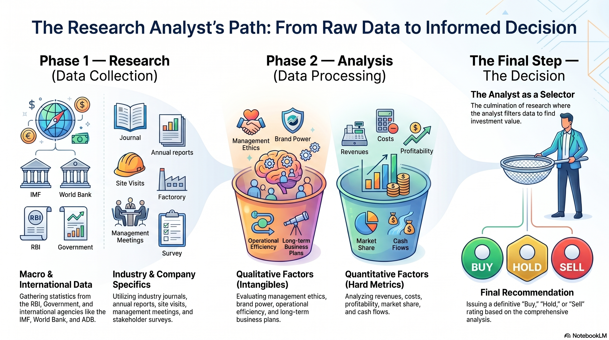

```
LEARNING OBJECTIVES:

After studying this chapter, you should know about:

• Investing activity and various approaches to investing
• Overview of Technical Analysis for investing in stocks
• Overview of the Fundamental Analysis for investing in stocks
• Overview of Quantitative Analysis (Econometrics approach)
• Overview of Behavioral Finance approach to equity investing 

```
## 4.1 What is Investing?

Investing is a more complicated task requiring higher level of rigour in terms of analysis. The level of analysis can be either at a broad asset class level or an investor may drill down deeper into individual stocks.

Investment, in the context of securities market, involves upfront commitment of a sum of money to earn returns on it during the investment horizon. It involves thorough analysis of the underlying security in terms of safety/risk, income, and growth potential.

!!! tag "Investing is the structured, data-driven deployment of monetary capital into financial instruments or assets (such as stocks, bonds, mutual funds, real estate, or commodities) with the explicit expectation of generating a positive financial return over a defined, medium-to-long-term holding period."

### 4.1.1 Types of Investing

Investing can be broadly classified as **Active** and **Passive** Investing.

#### Active Investing

Active investing involves identifying the specific security or set of securities that should be purchased or sold. It involves constant evaluation of every security in the investment portfolio so that investors can sell securities that are price d above their intrinsic value . Similarly, while buying securities , investors look to identify securities that are priced below their intrinsic value. 

Thus, active investing strategies require more effort and involve a greater number of transactions compared to passive strategies . The objective of an active investor is to earn a rate of return that is above th e return generated by the broader asset class.

#### Passive Investing

Passive investing involves investing in a broad set of securities that fairly repr esent the asset class the investor needs to invest. Typically, passive investing strategy follows indexing strategy where an investor buys all securities that are part of an index. 

The objective of a passive investor is to earn the rate of return that the select asset class provides. A passive investor does not decide upon individual securities to buy or sell but rather their analysis is limited to the broader asset class.

### 4.1.3 Core Financial Objectives of Investing

1. **Capital Appreciation:** The absolute nominal growth in the underlying market value of the asset.
2. **Income Generation:** Periodic, contractual, or discretionary cash inflows that accrue to the holder without requiring the asset's liquidation (e.g., corporate equity dividends, debt coupon interest payments).
3. **Inflation Protection:** Achieving a nominal rate of return ($R_n$) that systematically outperforms the rate of inflation ($I$), thereby keeping the real rate of return ($R_r$) positive via the Fisher link:

$$1 + R_n = (1 + R_r)(1 + I)$$

### 4.1.4 The Three Pillars of Wealth Deployment 

**Investing, Trading, and Speculation**

To succeed as an analyst, you must mathematically and structurally isolate these distinct capital market actions:

| Definitive Parameter | Investing | Trading | Speculation |
| --- | --- | --- | --- |
| **Analytical Core** | Deep fundamental value analysis (E-I-C Framework, earnings, cash flows). | Technical price chart configurations, volume patterns, short-term momentum. | High reliance on market rumors, intuition, sentiment shifts, or raw leverage. |
| **Time Horizon** | Medium to Long-Term (Months to Years) to capture corporate growth compounding. | Short-Term (Seconds, Intraday, to Days/Weeks). | Ultra-Short Term to Immediate (highly event-driven). |
| **Risk Profile** | Calculated, modeled, diversified, and fundamentally managed risk. | Calculated and restricted via technical stop-losses and position sizing. | High-risk exposure; often unmatched or unhedged position sizing. |
| **Primary Goal** | Compounded wealth creation, capital growth, and structural income generation. | Capturing rapid directional price swings and price inefficiencies. | Generating explosive, short-term returns from aggressive asset price movements. |

Investing is very distinct from trading or speculative activities. A trader attempts to earn profit by earning a spread between selling price and buying price without a necessary change in the underlying value of the asset. Therefore, they motivated by a historical price pattern and its re-occurrence in future, rather than a direction bet based on some incomplete information about the asset. 

Thus, a trader’s time horizon is usually short. In the context of securities 
market, traders would be termed speculators when they bet on the short-term movement of the asset prices, based on their calculated guess, and take suitable position in anticipation of profits, when their guess is correct. If they are depending on the price patterns and some related charting techniques, they are termed as chartists. If their entire investment and disinvestment cycle is 1 day, they are day traders. 

## 4.2 The Role of Research in Investment Activity

### 4.2.1 Core Components of the RA Role

**Research:** The process of obtaining all the necessary information required to meet a specific goal, objective, or research question.

**Analysis:** The process of examining and evaluating all available information to arrive at a logical conclusion.

#### Limitations of Company Annual Reports

**Value vs. Scrutiny:** Although an annual report is a treasure trove of data, gaining thorough insights requires a highly detailed, painstaking scrutiny.

**Information is Dated:** Because annual reports are published only once a year, the information they contain rapidly becomes outdated over time.

**Inadequate Scope:** Annual reports often fail to cover the industry conditions or broader macroeconomic factors in sufficient depth.

#### Channels of Secondary and Primary Research

To bridge information gaps, analysts must actively look beyond corporate filings:

**Scope of Research:** 

- Requires significant time dedicated to investigating three key layers: The broader economy, the specific industry, and the individual company.

**Secondary Research Methods:**

- Speaking to industry experts.
- Accessing dedicated reports from market research firms.
- Conducting secondary research to track macroeconomic shifts and competitor actions.

**Primary Research Methods:**

- Visiting the company’s operating facilities.
- Speaking directly with customers, suppliers, employees, and other stakeholders.

### 4.2.2 Insider Information vs Mosaic Analysis

- **Strict Prohibition and Ethical Boundary:** An analyst's research must never involve collating or utilizing insider information. Maintaining this ethical boundary is a core responsibility of a research analyst.
- **Definition of Insider Information:** Insider information is any material, non-public, price-sensitive information about a company that is not available to the public at large. When published, this data would immediately affect an investor’s decision to buy or sell the security.
- **Privileged Access & Determining Factors:** Such information is strictly confined to a handful of individuals closely connected to the company (or their relatives) who are privy to confidential corporate data. Whether information is officially considered "insider" depends on its source (reliability), its impact, and its certainty.
- **Public vs. Non-Public Distinction:** During the research process, an analyst may encounter information not known to the general public, but not all such data falls under insider information. For example, a CEO talking about an unpublished acquisition proposal constitutes insider information. Conversely, an employee mentioning an increasing workload in the purchase department (which may indicate higher business activity) does not fall under this strict definition.
- **Mosaic Analysis:** Analysts often collate bits of information from different public or non-public sources. Individually, these details may not be significant, but when put together, they provide critical insights. This synthesis is known as **mosaic analysis** and is fully acceptable.
- **The Analyst's Duty:** Analysts must remain highly vigilant and careful to distinguish whether a specific research insight was legitimately drawn from their own mosaic analysis or obtained by being inappropriately privy to specific, non-public, price-sensitive insider information.

### 4.2.3 Structural Breakdown of the Data Tiers



**Macroeconomic Variables:** 

- Collected directly from central banks (e.g., Reserve Bank of India) and supranational entities (IMF, World Bank). 
- Inputs track Gross Domestic Product ($GDP$), Consumer Price Index ($CPI$) variations, interest rate cycles, and balance of payments data.

**Industry Performance Trackers:** 

- Sourced from trade journals, sector indices, and regulatory whitepapers. 
- ocus areas cover total addressable market ($TAM$), supply chain shifts, and structural value migration trends.

**Company Disclosures:** 

- Sourced from audited regulatory filings (Balance Sheet, Profit & Loss Accounts, Cash Flow statements, Notes to Accounts, Auditor Reports) alongside management guidance and localized channel checks.

## 4.3 Technical Analysis

Technical analysis focuses on forecasting the direction and magnitude of stock price movements through the study of patterns in historical market data—primarily **Price** and **Volume**—plotted visually on charts.

### 4.3.1 Core Assumptions and Principles

**Price Reflection (The Market Discounts Everything):** 

Assumes that all information that can affect the performance of a share, including company fundamentals, economic factors, and market sentiments, is already fully reflected in the stock prices.

**Primary Objective (History Repeats Itself):** 

Focuses on forecasting the direction of prices through the study of recurring patterns in historical market data.

**Trend Focus (Prices Move in Trends):** 

Technicians (or chartists) believe that market activity generates indicators in price trends that can be followed to project future movements.

### 4.3.2 Three Essential Elements in Price Behaviour

Technical analysis relies on three core components to understand price behavior:

1. **History of Past Prices:** Provides indications of the underlying trend and its direction.
2. **Volume of Trading:** Accompanies price movements and provides important inputs on the underlying strength of the trend.
3. **Time Span:** The period over which price and volume carry the impact of long-term factors influencing prices.

### 4.3.3 Integration into Charts and Market Trends

**Trend Analysis:** 

- Involves the study of various trends—upwards, downwards, or sideways—so that traders can benefit by trading in line with the trend.

**Support and Resistance Levels:** 

- Represent points at which there is a lot of buying (support) and selling (resistance) interest respectively.
- Used to draw conclusions from past price movements. For example, if a stock price moves closer to an established resistance level, a holder can benefit by booking profits since prices are likely to retract.

**Breakouts and Volume Confirmation:** 

- If a support or resistance level is broken and accompanied by strong volumes, it may indicate that the trend has accelerated and the supply and demand situation has changed.
- Trading volumes serve as important parameters to confirm a trend. Upward or downward trends should be accompanied by strong volumes; if a trend is not supported by volumes, it may indicate a weakness in the trend.

### 4.3.4 Charting Techniques and Tools

**Data Visualization:** Converts price and volume data into charts that represent stock price movements over a period of time.

**Common Chart Types:** Includes line charts, bar charts, and candlestick charts.

**Pattern Utilization:** Patterns thrown up by charts are used to identify trends, reversal of trends, and triggers for buying or selling a stock.

**Moving Averages:** Used by chartists to reduce the impact of day-to-day fluctuations in prices, making it easier to identify the true underlying trend.

### 4.3.5 Horizon Suitability Comparison

| Factor / Attribute | Short-Term Horizon (Traders & Short-Term Investors) | Long-Term Horizon (Long-Term Investors) |
| --- | --- | --- |
| **Primary Reliance** | Rely largely on technical signals. | Rely on business fundamentals. |
| **Stability of Fundamentals** | Business fundamentals seldom change drastically in the short run. | Business fundamentals may change significantly in the long term. |
| **Suitability of Technical Analysis** | Highly suitable due to stable short-term fundamentals. | Less likely to be suitable, as past trends in share prices become unreliable for understanding subsequent movements. |

## 4.4 Fundamental Analysis

### 4.4.1 Core Premise and Philosophy

**Long-Term Focus:** Unlike technical analysis, fundamental analysis is focused exclusively on long-term investing.

**Value Drivers:** Operates on the premise that since equity shares reflect part ownership of a company, its long-term value must be driven by the profits and cash flows generated by the company on its investments.

**Market Mispricing:** If short-term price movements cause the market price to significantly diverge from its fair value, it creates a profit-making opportunity.

**Contradiction to EMH:** This philosophy directly contradicts the Efficient Market Hypothesis (EMH), which propagates that share prices continuously incorporate and reflect all relevant information.

### 4.4.2 Investment Decision Matrix

Profits in investments depend not only on identifying a good investment option but also on making the investment at the right price. Analysts determine actions by comparing the market price to the estimated fair value (intrinsic value):

| Market Condition | Valuation Assessment | Recommended Action |
| --- | --- | --- |
| **Market Price < Intrinsic Value** | The stock is undervalued; represents an attractive investment opportunity. | **Buy / Hold** |
| **Market Price > Intrinsic Value** | The stock is overvalued; market price is above the fair price of the business. | **Sell / Avoid** |

### 4.4.3 The Three Framework Baskets (E-I-C Analysis)

Fundamental analysis involves a comprehensive study of a company’s business operations and governance style. All key analytical questions are grouped into three structured baskets:

#### Economic Analysis

- Gauges the overall cyclical and secular macroeconomic trends.
- Evaluates whether the broader economic environment is likely to help the industry grow or cause it to decline.

#### Industry Analysis

- Examines the competitive intensity within the specific industry.
- Evaluates whether the prevailing industry dynamics are conducive for existing players to thrive.

#### Company Analysis

**Competitive Positioning:** Analyzes how the company is positioned vis-à-vis its direct competitors and whether it will perform better or worse than them.

**Cost Structure:** Evaluates the company's cost structure and how it is likely to impact profitability under different business environments.

**Financial Health:** Reviews the strength of the company’s financial position to see if it can fund future growth or withstand an operational crisis.

**Management Capabilities:** Assesses whether the management can identify and execute the right strategies to exploit growth opportunities while defending the business from adversities.

**Corporate Governance:** Verifies if the right governance structure is present to ensure that the board of directors and management act in the best interest of shareholders.

## 4.5 Quantitative Research

### Core Philosophy and Definition

**Data-Driven Approach:** Quantitative research applies strict mathematical frameworks, statistical tests, and rule-based data screens to historical records. This method eliminates human emotion, subjectivity, and cognitive variance from the selection cycle.

**Cross-Disciplinary Application:** This approach can be integrated into both major research methods:

  1. **In Technical Analysis:** Analysts bypass reading visual charts entirely and focus purely on the underlying data. They study statistical relationships between price up-moves, down-moves, trading volume, and other parameters to gauge the direction of stock prices.
  
  2. **In Fundamental Analysis:** While traditional fundamental research involves a blend of both quantitative and qualitative studies, some analysts approach equity analysis from a purely quantitative perspective.

### Methodological Tools and Projections

To project future earnings, valuations, and financial performance, quantitative analysts utilize a progressive suite of tools:

- **Time Series Analysis & Regression:** Used at the simplest level to analyze historical finance and operational metrics to extrapolate future earnings.
- **Econometric Approaches:** Sophisticated econometric and statistical methodologies are utilized to refine output data.
- **Financial Statement Analysis Tools:** Applied to project future financials and calculate corporate growth rates.
- **Sensitivity Analysis & Simulations:** Programmatic tests executed to isolate and understand the impact of modifying key baseline assumptions on asset valuations.

### Essential Quantitative Metrics, Equations, and Screens

Quantitative analysis relies heavily on specific statistical formulas and automated screens to isolate financial indicators:

- **Asset Price Volatility ($\sigma$):** The statistical standard deviation of a security's historical returns, serving as the benchmark measurement for total investment risk exposure.
- **Systematic Risk Coefficient ($\beta$):** Measures the volatility of a security ($R_i$) relative to the broader market index portfolio ($R_m$):

$$\beta = \frac{\text{Covariance}(R_i, R_m)}{\text{Variance}(R_m)}$$


- **The Sharpe Ratio (Risk-Adjusted Outperformance Evaluation):** Measures the structural excess return generated by an investment portfolio ($R_p$) per unit of its total standard deviation risk exposure ($\sigma_p$), where $R_f$ is the risk-free benchmark rate:

$$\text{Sharpe Ratio} = \frac{R_p - R_f}{\sigma_p}$$


- **Systematic Factor Screeners:** Programmatic filters applied to clean institutional databases to automatically extract target securities based on fixed parameters.

| Sample Screener Parameter | Target Criteria | Operational Rationale |
| --- | --- | --- |
| **Cash Conversion Screen** | $\text{Operating Cash Flow / Net Profit Ratio} \ge 1.0$ | Identifies strong earnings quality and high cash generation. |
| **Profitability Screen** | $\text{Return on Equity (ROE)} > 20\%$ | Filters for highly efficient equity capital deployment. |
| **Leverage Screen** | $\text{Debt-to-Equity Ratio} < 0.5$ | Isolates companies with low financial risk exposure. |

### Core Strategic Limitations

Despite its mathematical precision, applying a pure quantitative or econometric approach to fundamental analysis suffers from major structural limitations:

- **Availability of Comparable Data:** Frequent changes in accounting standards and shifting corporate business models make historical past data less useful when compared with present market conditions.
- **Conclusion:** Due to these historical data discrepancies, a pure quantitative research approach is not often employed in isolation for comprehensive fundamental analysis.

## 4.6 Behavioural Approach to Equity Investing

### Core Premise and Philosophy

- **Psychological Influence:** Investment decisions are ideally based on the analysis of available information to reflect expected performance and risks. However, very often decisions are heavily influenced by the behavioral biases of the decision maker, leading to less than optimal choices being made.
- **Fear and Greed Driving Prices:** Proponents of behavioral finance integrate psychological insight with financial economics. They assume that securities' prices drift away from their fair fundamental values (either to the upside or downside) due to the systemic fear and greed of market participants.

### High-Level Behavioral Anomalies

The specific psychological flaws and emotional biases that alter rational investment cycles include:

- **Herd Mentality:** Driven by the psychological pressure to copy the collective behavior of the crowd. This fuels structural asset bubbles during market upswings out of the fear of missing out and accelerates severe market crashes through collective panic-selling.
- **Anchoring Bias:** A cognitive flaw where an investor or analyst weights their valuation expectations too heavily toward an arbitrary historical benchmark—such as a stock's past all-time high or its initial purchase price—failing to update their outlook even as current business fundamentals decay.
- **Loss Aversion:** Rooted in the reality that the psychological pain of booking a financial loss is roughly twice as intense as the utility derived from making an equivalent profit gain. This emotional imbalance causes investors to hold onto declining, value-destructive positions in the hope of breaking even, while selling winning positions prematurely.
- **Overconfidence Bias:** Involves underestimating downside probability distributions while overestimating forecasting precision. This bias frequently leads to over-trading, excessive leverage, and a relaxed attitude toward essential risk metrics.

!!! tag "Cross-Reference Note: While this section serves as an essential framework overview within the fundamentals of research, a more comprehensive analysis of these well-documented behavioral biases and their direct influence on market decision-making is covered in detail in Chapter 11."

## 4.7 Fundamental Analysis – Commodity

### Core Philosophy and Definition

- **Market Mechanics:** Fundamental analysis in commodities is the study of economic, political, and natural factors that influence the supply and demand of commodities, thereby determining their price movements.
- **Analytical Scope:** Rather than focusing on corporate earnings or financial metrics, commodity fundamental analysis largely focuses on the structural dynamics of physical goods. This includes the study of supply and demand factors, seasonality, macroeconomic conditions, news, currency movements, interest rates, weather, inventory levels, and government intervention.

### Supply-Side Dynamics

The key supply-side factors that restrict or expand the physical availability of a commodity, influencing market fluctuations, include:

1. **Production:** Direct output volumes originating from farms (agricultural products), oil wells (energy), and mines (metals).
2. **Weather Conditions:** Sudden natural events such as floods, droughts, and cyclonic effects that physically disrupt crop yields or extraction operations.
3. **Government Policies:** Regulatory actions including tariffs, levies, subsidies, and strict trade restrictions or promotions.
4. **Geopolitical Events:** Structural disruptions caused by sanctions, wars, and international trade disputes.
5. **Input Costs:** Changes in operating overheads, including energy costs, raw input costs, labor wages, and technological adaptations.

### Demand-Side Dynamics

The key consumption drivers that influence global demand and cause commodity market fluctuations include:

1. **Global Economic Growth:** Improvements in global GDP accelerate industrial activity, creating additional demand for base metals, energy resources, and agricultural products.
2. **Population Growth & Urbanization:** Structural expansions in population sizes and city developments that permanently increase global food and energy consumption scales.
3. **Substitution Effect:** The economic choice of switching between alternative commodities when relative prices fluctuate.
4. **Seasonal Demand:** Predictable consumption spikes, such as higher heating fuel demand in winter, cooling fuel demand in summer, or specific festive food demand.
5. **Consumer Preferences:** Long-term secular shifts in purchasing habits, such as transitions to organic foods, renewable energy systems, and electric vehicles.

### Macroeconomic Indicators

Broader macroeconomic signals establish price trends across financialized commodity markets:

| Macroeconomic Indicator | Market Mechanism | Financial Effect on Commodities |
| --- | --- | --- |
| **Inflation** | Commodities possess intrinsic physical value. Precious metals (especially Gold and Silver) are heavily utilized as an inflation hedge to protect purchasing power. | **Positively Correlated** (Prices tend to rise with high inflation) |
| **Interest Rates** | Higher global interest rates alter capital flows and typically strengthen the United States Dollar (USD). Since global commodities are priced in USD, a stronger dollar increases buying costs abroad. | **Negatively Correlated** (Higher rates typically lower commodity prices) |
| **Trade Balance & Industrial Data** | Economic metrics such as the Purchasing Managers' Index (PMI) and Industrial Production data indicate industrial manufacturing health, directly altering the consumption velocity of base metals and energy. | **Direct Indicator** (Strong industrial data boosts industrial commodity demand) |

## 4.8 Case Studies: Analytical Research Findings

### Case Study: Bullion – Gold

#### 1. Macroeconomic Role and Core Characteristics

Gold operates under unique economic principles compared to traditional corporate securities. Research findings demonstrate that it carries a structural **inverse relationship** with equities, bonds, and fiat currencies.

- **The Safe-Haven Phenomenon:** During macro-systemic downturns or environments of severe economic turbulence when traditional capital markets underperform, investors systematically migrate capital into gold to preserve value.
- **Inflation Hedging:** Because it functions as a tangible store of value, gold serves as a physical buffer against currency degradation and inflationary pressures.

#### 2. Sectoral Demand Breakdown

An analysis of the global structural demand allocation indicates that consumption is heavily driven by retail storage and monetary institutional support rather than industrial application:

| Sector | Allocation (%) | Structural Characterization |
| --- | --- | --- |
| **Jewellery** | 47% | The primary demand anchor, heavily influenced by retail consumer behavior and seasonal/cultural patterns. |
| **Investment** | 24% | Financialized demand (e.g., bar/coin hoarding or ETF buying) driven by wealth preservation motives. |
| **Central Bank** | 23% | Institutional reserves accumulation used to diversify national holdings away from fiat credit risk. |
| **Technology** | 6% | Minor industrial component representing physical usage in electronics or specialized applications. |

#### 3. Geographic Concentration of Supply and Demand

The structural balance of global gold markets is concentrated within a few major nations. A core finding is that **China holds a dual position** as the world's leading physical extraction source and its largest final consumer market.

| Market Position | Dominant Geographies (Ranked 1 to 5) |
| --- | --- |
| **Major Producers** | China, Australia, Russia, USA, Canada |
| **Major Consumers** | China, India, USA, Germany, Saudi Arabia |

#### 4. Price Driving Factors and Market Mechanisms

Gold price discovery relies on identifying changes across interest rates, macroeconomic metrics, currency valuations, and capital market performance:

- **Monetary Policy & Yield Environments:** Lower bond yields or an expansionary monetary policy (lowering interest rates) act as **positive price triggers (+)**. Conversely, contracting monetary policies (interest rate hikes) or higher bond yields act as **negative price triggers (-)** by raising the opportunity cost of holding a non-yielding asset.
- **The Dollar Correlation:** Gold maintains a strict negative correlation with the global reserve currency. A weaker U.S. Dollar decreases purchasing barriers globally, serving as a **positive trigger (+)**, whereas a stronger U.S. Dollar serves as a **negative trigger (-)**.
- **Economic Data & Risk Sentiment:** Weaker macroeconomic metrics (declining GDP, slowing manufacturing, or weakening labor reports) and bearish equity trends signal systemic stress, functioning as **positive triggers (+)** for gold due to safe-haven inflows. Stronger economic growth and a bullish stock market cause capital to exit gold for higher-risk assets, working as **negative triggers (-)**.
- **Institutional Flow Tracking:** Programmatic institutional accumulation through Exchange Traded Funds (ETFs) or direct Central Bank buying systematically builds a structural demand floor, providing **positive price triggers (+)**, while net liquidations or selling activity create **negative pressures (-)**.

### Case Study: Energy – Crude Oil

#### 1. Macroeconomic Role and Core Characteristics

Crude Oil is traditionally termed the **"mother of the global financial market"** or **"black gold"** due to its pervasive role in underwriting global industrial activity and economic expansion.

- **Economic Lifeline:** Naturally occurring as a highly flammable liquid within subsurface rock formations, its primary value is unlocked via fractional distillation at varying temperatures. This process yields critical downstream industrial components: bitumen (road asphalt), lubricants, fuel oil, diesel, paraffin, naphtha, and gasoline.
- **The Inflation Transmission Vector:** Because transport fuels and polymers (plastics for consumer goods, bottles, and packaging) act as raw inputs across nearly all global economic supply chains, any supply-demand imbalance in the crude oil market instantly translates into cross-border inflationary concerns.

#### 2. Structural Quality and Quality Benchmarks

Crude oil price discovery is highly dependent on physical grading specifications, which are benchmarked against two primary variables: **Density** and **Sulphur Content**:

- **West Texas Intermediate (WTI):** A light, low-sulphur ("sweet") crude oil benchmark predominantly explored and physically settled within the United States. It possesses an API gravity of $39^\circ$ and a minimal Sulphur content of $0.24\%$. It is financialized and traded primarily on the New York Mercantile Exchange (**NYMEX**).
- **Brent Oil:** The premier international pricing benchmark used to value crude supplies moving out of Europe, Africa, and the Middle East, originating from the United Kingdom's North Sea fields. It has an API gravity of $38^\circ$ and a Sulphur content of $0.4\%$. It is financialized and traded primarily on the Intercontinental Exchange (**ICE**).

#### 3. Geopolitical Supply Control and Market Concentration

Global energy distribution is heavily impacted by strict cartelized production and geographical infrastructure limitations:

- **The OPEC+ Dominance:** Global crude supply lines are tightly managed by a duopoly consisting of the United States and the OPEC+ coalition (comprising 13 formal OPEC member nations plus aligned external producers, led by Russia).
- **Reserve Concentration:** The Middle East holds a commanding structural bottleneck, accounting for **48% of all proven global oil reserves**. Within this footprint, OPEC alone controls roughly 40% of ongoing global production, acts as the custodian for 75% of total proven world reserves, and commands 55% of the international oil export market.

#### 4. Geographic Concentration of Production and Consumption

The physical flow of energy highlights the massive industrial reliance of expanding Asian economies (specifically China and India) on foreign energy inputs, contrasted with the United States' unique position as both the top global producer and consumer:

| Market Position | Dominant Geographies (Ranked 1 to 5) |
| --- | --- |
| **Major Producers** | USA, Russia, Saudi Arabia, Canada, China |
| **Major Consumers** | USA, China, India, Germany, Japan |

#### 5. Price Driving Factors and Market Mechanisms

Crude oil behaves as an industrial asset, meaning its price discovery runs inversely to safe-haven assets like gold:

- **Supply Manipulation and Infrastructure Tracking:** Tightening production quotas by the OPEC+ group, drops in domestic U.S. output, falling active U.S. oil rig counts, or shrinking U.S. commercial inventory levels all shrink total available supply, functioning as **positive price triggers (+)**. Increases in production quotas, rising rig counts, or expanding commercial inventories act as **negative price triggers (-)**.
- **Macroeconomic Health & Capital Benchmarks:** Unlike gold, expanding macroeconomic metrics (booming GDP growth, rising industrial output indices, and bullish equity markets) signify a direct acceleration in industrial energy consumption, acting as **positive price triggers (+)**. Economic contractions or bearish stock trends compress demand, serving as **negative price triggers (-)**.
- **Exogenous Disruptions (Weather and Geopolitics):** Unstable political environments within the Middle East or severe weather patterns in production hubs (such as the hurricane season across the Gulf of Mexico) threaten infrastructure continuity and trigger risk premiums, acting as **positive price triggers (+)**. A return to political stability or calm weather patterns functions as a **negative price trigger (-)**.
- **The Dollar Denomination Effect:** Because global crude oil is invoiced and settled internationally in U.S. Dollars (USD), currency movements shift physical buying power. A weaker USD acts as a **positive price trigger (+)** by making oil cheaper for foreign purchasers, whereas a strengthening USD functions as a **negative price trigger (-)**.

## 4.9 Historical Events: Case Study Analysis

### Case Analysis: The Negative Oil Pricing Anomaly (April 20, 2020)

#### Operational Facts & Market Dynamics

- **The Event:** On April 20, 2020, West Texas Intermediate (WTI) crude oil prices collapsed below zero, entering negative territory for the first time in history.
- **Exogenous Catalyst:** Roughly 90% of the global economy was placed under strict pandemic-induced lockdown restrictions to curb the spread of coronavirus, completely destroying immediate physical fuel demand.
- **Contractual Bottleneck:** The WTI futures contract for May delivery was scheduled to expire on the subsequent day (April 21, 2020). WTI is a **physically deliverable contract** legally tied to the infrastructure hub at Cushing, Oklahoma.
- **The Valuation Collapse:** Due to lockdown-induced logistical restrictions on moving physical oil, combined with near-capacity local storage facilities, speculative buyers and financial participants holding the expiring contracts were completely unable or unwilling to take physical delivery.
- **The Pricing Rationale:** To escape the legal and financial obligations of physical delivery, contract holders engaged in extreme panic selling. Buyers essentially paid counter-parties to take the oil contracts off their hands, overriding traditional cost-of-production pricing floors and forcing market clearing prices below zero.

#### Historical Parallel: The 1973 Cartel Shock

The 2020 demand-collapse crisis stands in stark contrast to the structural supply shock of **1973**. During this post-World War II crisis, the Organization of the Petroleum Exporting Countries (OPEC) wielded its market power to drastically alter the global energy landscape:

- **Pricing Action:** OPEC unilaterally quadrupled oil prices, raising them to approximately $12 a barrel.
- **Embargo Execution:** The cartel placed an outright prohibition on oil exports to the United States, Japan, and Western Europe—nations that collectively consumed over half of the global oil supply at the time. This action solidified crude oil's status as a critical geopolitical transmission mechanism.

## 4.10 Impact of Commodity Market on Equity Market

### The Input Cost Transmission Mechanism

Commodity and equity markets maintain a close relationship because listed corporations rely heavily on raw commodities as industrial inputs. Changes in upstream commodity pricing flow directly into corporate income statements:

- **Rising Commodity Prices:** Function as an input cost shock. This compresses corporate gross and net profit margins, causing downward adjustments in corporate earnings expectations and stock valuations.
- **Falling Commodity Prices:** Act as an operating cost relief. This expands profit margins, improves corporate profitability, and drives upward stock valuation adjustments.

### Sectoral Divergence Matrix (Crude Oil Example)

A change in a core commodity does not impact the equity market uniformly; it creates distinct winners and losers depending on a sector's position relative to the raw input:

| Sector Type | Strategic Position | Structural Mechanism | Equity Market Impact |
| --- | --- | --- | --- |
| **Upstream Producers** *(e.g., Oil Exploration & Production)* | Input Seller | Rising commodity prices increase revenues directly against a fixed operational cost base. | **Positive Impact (+)** <br><br>Profitability improves |
| **Downstream Consumers** *(e.g., Airlines & Logistics)* | Input Buyer | Rising commodity prices escalate fuel, manufacturing, and transport overheads. | **Negative Impact (-)** <br><br>Profitability declines |

### Commodities as Global Macroeconomic Signals

Because commodities are globally traded, physical price discovery serves as a leading indicator for systemic demand shifts. Equity markets are sensitive to economic growth prospects and react dynamically to these signals:

**The Industrial Demand Signal:** 

- Physical industrial metals reflect structural manufacturing momentum.

**Case Study Example (Copper):** 

- A significant fall in copper prices typically flags a broader contraction in global industrial and manufacturing demand. 
- Equity markets read this signal early, dragging down metal, mining, manufacturing, and core infrastructure stocks ahead of lagging official economic data.

## Key Takeaways:

Here is a brief summary of the key takeaways from Chapter 4 (Fundamentals of Research) - Major Sections:

**Ethical Boundary & Research:** 

Analysts are strictly prohibited from utilizing material, non-public **insider information** (which immediately affects investment decisions). However, collecting individual pieces of public/non-public details and piecing them together to gain critical insights—known as **Mosaic Analysis**—is fully acceptable.

**Technical Analysis Framework:** 

Focuses entirely on forecasting short-term price directions by reading historical **Price and Volume** patterns on charts. It operates on the core axiom that the market discounts everything (all fundamentals and sentiments are already reflected in the stock price).

**Fundamental Analysis (Equity):** 

Focused on long-term investing under the premise that stock value is driven by corporate profits and cash flows. Investors capitalize on mispricing by buying when the market price falls below a business's **intrinsic value** and selling when it rises above it, utilizing **E-I-C (Economic, Industry, Company) Analysis**.

**Quantitative Research:** 

Relies on strict mathematical frameworks, statistical equations (like Volatility $\sigma$, Systematic Risk $\beta$, and the Sharpe Ratio), and rule-based data screeners to remove human emotion. It is rarely used in isolation for fundamental analysis due to historical data discrepancies caused by changing accounting standards.

**Behavioural Finance Approach:** 

Proves that market participants are not perfectly rational and are driven by psychological fear and greed. This creates systematic biases—such as **Herd Mentality**, **Anchoring Bias**, **Loss Aversion**, and **Overconfidence**—which temporarily push security prices away from their fair values.

**Fundamental Analysis (Commodities):** 

Unlike equities, commodity research focuses on the physical supply-demand balance, weather events, geopolitical tensions, macro indicators (inflation and interest rates), and storage inventory rather than corporate financial health.

- **Asset-Specific Drivers (Gold vs. Crude Oil):** * **Gold** acts as a safe haven and inflation hedge, moving inversely to traditional equities and bonds.

- **Crude Oil** serves as the industrial lifeline of the global economy, directly affecting cross-border inflation and causing divergent sectoral equity movements (boosting upstream energy producers while hurting downstream consumers like airlines).

**Historical Anomalies & Transmission:** 

Exogenous events can warp standard financial rules, as seen in the **April 2020 negative WTI crude pricing** caused by pandemic storage lockdowns and contract expiry rules. Ultimately, commodity price shifts serve as leading macro indicators that directly impact equity market valuations and profit margins.
