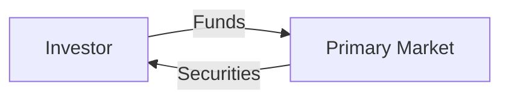
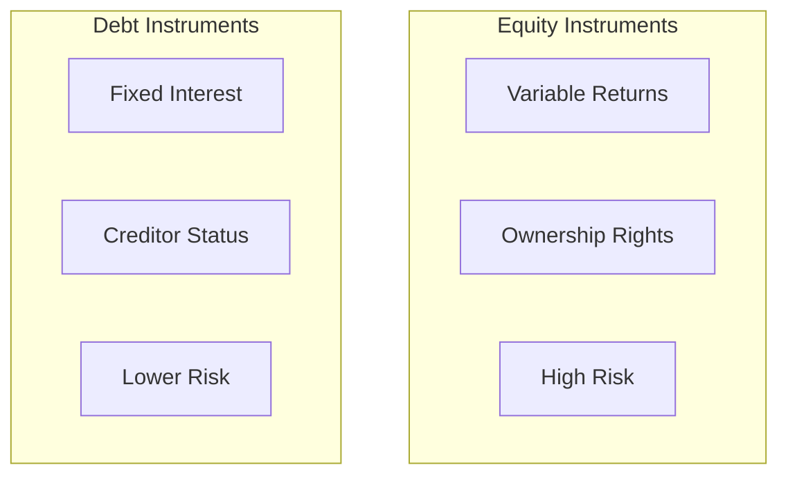

# NISM-RA Study Guide: Visual Frameworks

## 1. Flowcharts (Standard Process)
Use this for market cycles and transaction flows.

---

## 2. Comparison Cards (The Mermaid Fix)

Since standard Markdown grids are failing, use **Subgraphs** to create side-by-side "Cards." This is 100% stable.

## 3. Admonitions (Working Blocks)

These work because they are standard extensions. Use them for quick tips.

!!! tip "Exam Strategy"
Expect 2-3 questions on Warrants. Remember: Warrants are issued by the company!

!!! danger "Negative Marking"
Wrong answers cost **0.25 marks**.

---

## 4. Content Tabs (Working Blocks)

Use these for switching between "Theory" and "Calculation" views.

=== "Formula"
    $$ \text{Current Ratio} = \frac{\text{Current Assets}}{\text{Current Liabilities}} $$

=== "Logic"
    The Current Ratio measures a company's ability to pay short-term obligations. A ratio under 1.0 indicates potential liquidity issues.

## 5. Collapsible Details

Perfect for hiding the answer to a practice question.

??? question "Who regulates the Mutual Fund industry?"
    **SEBI** (Securities and Exchange Board of India) is the primary regulator. AMFI is an industry association.

## 6. CSS Card

  

    
Equity Instruments

    

      Common equity shares represent residual ownership interest in a corporation.
      <ul style="margin-top: 10px; padding-left: 20px;">
        <li><strong>Rights:</strong> Voting privileges</li>
        <li><strong>Returns:</strong> Variable dividends</li>
      </ul>
    

    
Regulated by SEBI

  

  

    
Fixed Income Instruments

    

      Bonds and debentures represent debt obligations issued by a borrowing entity.
      <ul style="margin-top: 10px; padding-left: 20px;">
        <li><strong>Status:</strong> Creditors, not owners</li>
        <li><strong>Returns:</strong> Fixed interest payments</li>
      </ul>
    

    
Regulated by RBI / SEBI

  

  

    
Derivative Instruments

    

      Financial contracts deriving value from an underlying benchmark asset.
      <ul style="margin-top: 10px; padding-left: 20px;">
        <li><strong>Types:</strong> Futures, Options, Warrants</li>
        <li><strong>Use:</strong> Risk hedging or speculation</li>
      </ul>
    

    
Regulated by SEBI

  

